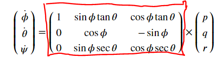
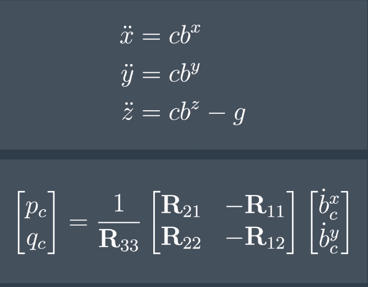
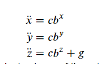
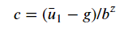
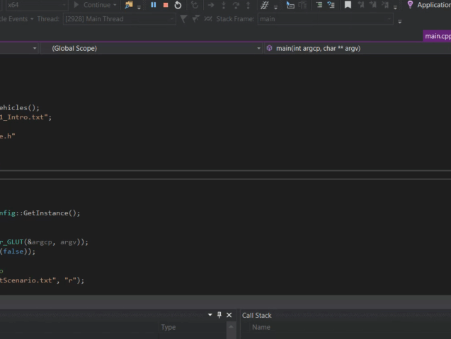
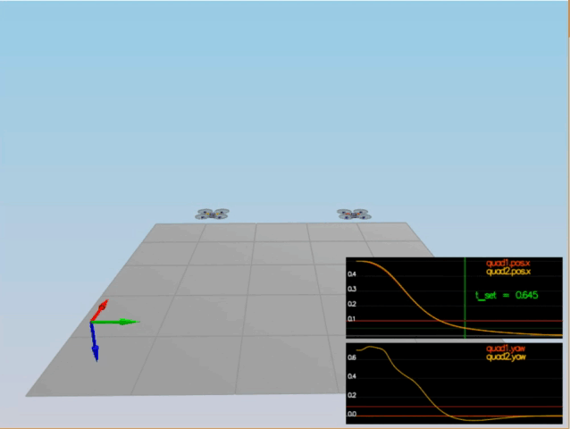
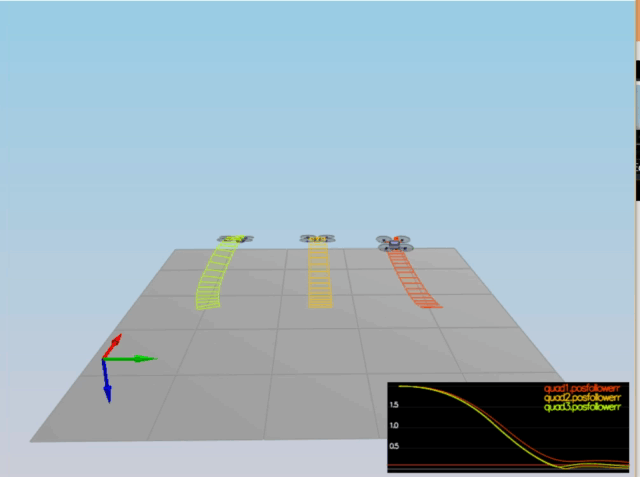
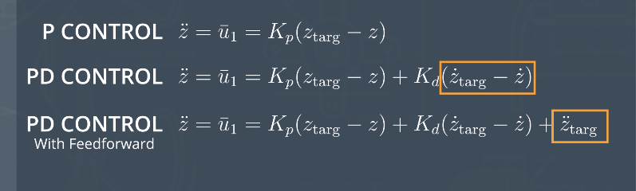
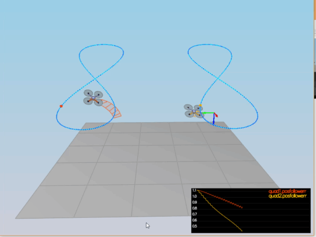

# 
<b> Cascaded PID Controller </b>

### 
<b><i> Forces & Moments </i></b>

The control of an autonomous flying vehicle boils down to the following objective: Given a trajectory, find the sequence of propeller turn rates that will cause the drone to fly that trajectory. 

A trajectory is a sequence of 3-dimensional positions, desired yaw (heading) and times at which to be in these locations.

In order to place the quadcopter at a desired position with a desired heading, we must control the rotation rates of the propellers. Doing so in such a manner that the net force and net moment acting on the quadcopter will cause it to exhibit the desired position and orientation at the desired timestep.

 

The illustration above is simplified, only showing forces applied in the horizontal and vertical directions. However, the physics are easily extended when stepping into the 3-dimensional world.

Each propeller generates a thrust vector - a force. To obtain the vertical force applied to the quad, decompose each propellers thrust vector into their corresponding vertical and horizontal components. Sum these forces with the force of gravity and solve for the vertical acceleration. Note: the quad exists in a North-East-Down reference frame, where gravity (straight downward) is positive. Do a similar calculation for horizontal force to find horizontal acceleration. 

Once the vertical and horizontal accelerations are obtained, the translation of the quadrotor can be easily found by integrating twice over some timestep, dt.

 

The rotational movement of the quadcopter is obtained by finding the net moment about the x-axis, y-axis, and z-axis, individually. Movement of the quadcopter about the x-axis is called roll, movement about the y-axis is called pitch, and movement about the z-axis is called yaw.

The image above is a simplified version but the concepts carry over easily to 3-dimensions. In the image above, the left propeller exerts a force greater than the force exerted by the right propeller. The force exerted is perpendicular to the axis of rotation, causing the quad to roll. The same concept is true for pitch. 

Yaw is an interesting case, in that this motion is the result of the *reactive* rotational forces induced by the spinning propellers. Each propeller produces a rotational force that is **opposite** the direction of its spin. Yaw is directly propotional to the rotational acceleration of a propeller. 

### 
<b><i>Closed Loop Control </i></b>

 

The diagram above is a representation of a high-level controller arhchitecture that is typically found on most quadcopter flight control units, such as Ardupilot and PX4. 

With only 4 thrust vectors and 6 degrees of freedom, only 4 of these degrees of freedom can be controlled at any one time. In practice, the translation (x,y, and z movement) and yaw of the quadcopter are controlled. This decision to control the translation and yaw of the quadrotor led to the design of the above cascaded control architecture.

A state vector of length 12 to represent and control the quadcopter in 3-dimensions. These 12 variables are:

1) x position, y position, z position
2) x velocity, y velocity, z velocity
3) roll, pitch, yaw in the world frame, representated by Euler angles
4) x-axis body rate (p), y-axis body rate (q), z-axis body rate (r)

*Note*: Item #5 describes the angular rotation rates (radians/s) about the **body frame** x-axis, y-axis, and z-axis, while item #4 describes the angle (radians) at which the quadcopter is oriented in the **world frame**.

 
<i> Body Rate Controller </i>

 
The Body Rate Controller takes as input the *commanded* x, y, and z, body rates and actual body rates (which are measured by an IMU). The controller then outputs *moments* that the quad needs to obtain the desired action.

The Body Rate Controller is a P controller and measures the difference between the current body rate and the commanded body rate (from higher level controllers). This error is then used to find the desired torque, or moment, about a respective axis,

 

where alpha is the P error and I is an inertial measurement that describes propensity for an object to rotate. Lastly, these torques are turned into actual rotor spin rates for the quad to implement.

<i> Roll-Pitch Controller </i>

 
The Roll-Pitch Controller is a P controller responsible for commanding the roll and pitch rates (p and q) in the body frame; note that yaw is dictated by a separate controller.

The inputs into the Roll-Pitch Controller are the commanded thrust, the commanded x/y accelerations, and the current attitude of the quad. In order to translate rotation rates in the body rate into rotation rates in the world frame, a rotation matrix describing these properties is used.

 

The drone generates lateral acceleration by changing the body orientation which results in non-zero thrust in the desired direction. The components of the thrust can be describes by the following set of equations,

 

where b^x and b^y are elements of the rotation matrix that map body frame thrust to their corresponding world frame accelerations.

Thus, the control knobs for dictating the quadrotor orientation are these rotation matrix elements and these are the elements that the Roll-Pitch Controller will be setting in order to control motion.

Lastly, b_dot^x-c is the P error of the desired rotation matrix value and the current rotation matrix value. Using the equation on the bottom, I can then use the commanded accelerations and thrust to set a target rotation matrix value and use the error in the target value and current value to generate a new q and p for the quad to implement.

<i> Lateral Controller </i>

The Lateral Controller is a PD controller that uses the error in position and velocity in the x and y axes to output a target x and y acceleration. Though simple, it is important to limit speed and acceleration in these directions. Note that the input to the lateral controller are desired positions and velocities given by the *trajectory*. 

<i> Altitude Controller </i>

The Altitude Controller is a PID controller that uses Feed-Forward input to control the vertical component of the thrust in order to obtain a desired vertical acceleration. The thrust component can be decomposed into the following parts, 

 

where b^x, b^y, and b^z are corresponding rotation matrix entries. Thus, using a PID, find the error in acceleration and then convert this error into a thrust command,

 

where u_bar is the PID error.

Note: the inputs into the Altitude Controller are obtained from the trajectory. Every point along the trajectory has a desired 3D position, velocity, orientation, and time.

<i> Yaw Controller </i>

The Yaw Controller is a P controller that finds the error between the target yaw (obtained from trajectory) and the drone's current yaw. Since this command is in radians, be sure to limit the value between [-pi,pi].

### 
<b><i>Simulation </i></b>

The simulator repo can be cloned [here](https://github.com/udacity/FCND-Controls-CPP.git). Please follow the steps for settings up the environment on your machine and using the simulator. 

The simulator is not visually pleasing, but it models the physics of a quadrotor with incredible fidelity!

The only modifications needed to run the simulator with the code in this repo is the replacement of two files:

1) QuadControl.cpp -> replaces existing QuadControl.cpp at <simulator>/src. This code contains the Cascaded PID Controller.
2) QuadControlParams.txt -> replaces existing document at <simulator>/config. This code contains the PID gains for each respective controller. 

<i> Scenario 2 - Body-Rate & Roll/Pitch Control </i>

 
 
In Scenario 2, the quad will start above the origin and is **created with a small initial rotation speed about its roll axis**. The controller should stabilize the rotational motion and bring the vehicle back to level attitude. A successful run is such that the roll of the vehicle is 0 while other rates remain 0.

Note that a successful run is indicated by a *green highlight* around the corresponding graph.

 

<i> Scenario 3 - Position/Velocity/Yaw Control </i>

Scenario 3 will control the position, altitude, and yaw for a pair of quads. 2 identical quads will be created where one is offset from its target point (but initialized with yaw = 0) and the second is offset from target point, but yaw = 45 degrees. A successful run has the quads going to their destination points and tracking error should be going down (view graph). However, *one quad remains rotated in yaw*.

 

<i> Scenario 4 - Non-Idealities & Robustness </i>

This is a configuration with 3 quads that are all are trying to move one meter forward. However, these quads are all a bit different:

1) The green quad has its center of mass shifted back
2) The orange vehicle is an ideal quad
3) The red vehicle is heavier than usual

A successful scenario should have all quads reaching their target 3D position with correct orientation.

 

<i> Scenario 5 - Tracking A Trajectory </i>

This scenario has two quadcopters:

1) the orange quad is following traj/FigureEight.txt

2) the yellow quad is following traj/FigureEight**FF**.txt, where desired acceleration is fed forward into the controller. 

 

By feeding the controller a desired acceleration, it works to center the controller error around a target acceleration and make changes based on the error in position and velocity.

 

### 
<b><i> Reality </i></b>

The following is a custom built quadcopter executing a figure-8 based, on a sinusoid, in real-time. The video has been sped up because I set the velocity to a low value. The sensor suite providing feedback is based on a Visual-Inertial system. 

 

