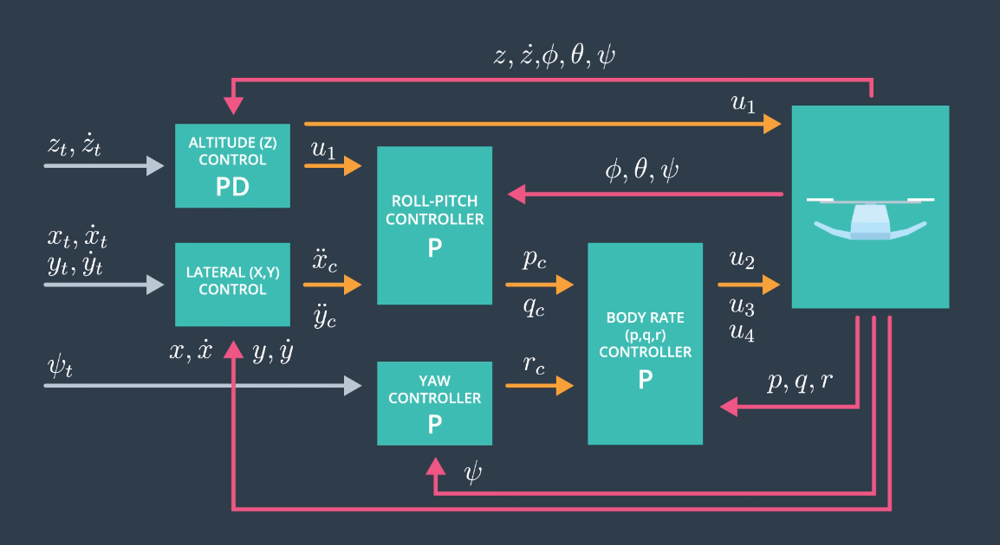
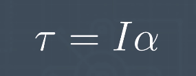

# 
<b> Cascaded PID Controller </b>

### 
<b><i> Forces & Moments </i></b>

The control of an autonomous flying vehicle boils down to the following objective: Given a trajectory, find the sequence of propeller turn rates that will cause the drone to fly that trajectory. 

A trajectory is a sequence of 3-dimensional positions, desired yaw (heading) and times at which to be in these locations.

In order to place the quadcopter at a desired position with a desired heading, we must control the rotation rates of the propellers. Doing so in such a manner that the net force and net moment acting on the quadcopter will cause it to exhibit the desired position and orientation at the desired timestep.

 

The illustration above is simplified, only showing forces applied in the horizontal and vertical directions. However, the physics are easily extended when stepping into the 3-dimensional world.

Each propeller generates a thrust vector - a force. To obtain the vertical force applied to the quad, decompose each propellers thrust vector into their corresponding vertical and horizontal components. Sum these forces with the force of gravity and solve for the vertical acceleration. Note: the quad exists in a North-East-Down reference frame, where gravity (straight downward) is positive. Do a similar calculation for horizontal force to find horizontal acceleration. 

Once the vertical and horizontal accelerations are obtained, the translation of the quadrotor can be easily found by integrating twice over some timestep, dt.

 

The rotational movement of the quadcopter is obtained by finding the net moment about the x-axis, y-axis, and z-axis, individually. Movement of the quadcopter about the x-axis is called roll, movement about the y-axis is called pitch, and movement about the z-axis is called yaw.

The image above is a simplified version but the concepts carry over easily to 3-dimensions. In the image above, the left propeller exerts a force greater than the force exerted by the right propeller. The force exerted is perpendicular to the axis of rotation, causing the quad to roll. The same concept is true for pitch. 

Yaw is an interesting case, in that this motion is the result of the *reactive* rotational forces induced by the spinning propellers. Each propeller produces a rotational force that is **opposite** the direction of its spin. Yaw is directly propotional to the rotational acceleration of a propeller. 

### 
<b><i>Closed Loop Control </i></b>

 

The diagram above is a representation of a high-level controller arhchitecture that is typically found on most quadcopter flight control units, such as Ardupilot and PX4. 

With only 4 thrust vectors and 6 degrees of freedom, only 4 of these degrees of freedom can be controlled at any one time. In practice, the translation (x,y, and z movement) and yaw of the quadcopter are controlled. This decision to control the translation and yaw of the quadrotor led to the design of the above cascaded control architecture.

A state vector of length 12 to represent and control the quadcopter in 3-dimensions. These 12 variables are:

1) x position, y position, z position
2) x velocity, y velocity, z velocity
3) roll, pitch, yaw in the world frame, representated by Euler angles
4) x-axis body rate (p), y-axis body rate (q), z-axis body rate (r)

*Note*: Item #5 describes the angular rotation rates (radians/s) about the **body frame** x-axis, y-axis, and z-axis, while item #4 describes the angle (radians) at which the quadcopter is oriented in the **world frame**.

 
<i> Body Rate Controller </i>

 
The Body Rate Controller takes as input the *commanded* x, y, and z, body rates and actual body rates (which are measured by an IMU). The controller then outputs *moments* that the quad needs to obtain the desired action.

The Body Rate Controller is a P controller and measures the difference between the current body rate and the commanded body rate (from higher level controllers). This error is then used to find the desired torque, or moment, about a respective axis,

 

where alpha is the P error and I is an inertial measurement that describes propensity for an object to rotate.

<i> Roll-Pitch Controller </i>

 

