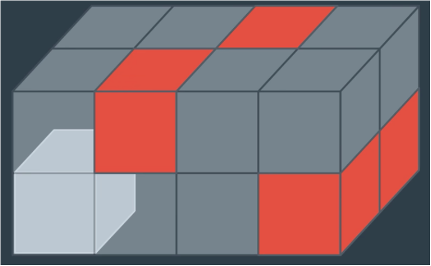

 # 
<b> Medial-Axis with Probabilistic Roadmap </b>

 
Planning is a crucial aspect of any autonomous agent. There exist a vast number of methods that attempt to solve this problem. From physical models that describe the intricate dynamics of the object to the black boxes of reinforcement learning. This problem is still an active area of research. 

Any planning solution will address 5 core areas:

1) State Space 
2) Action Space
3) Cost Function
4) Start State
5) Goal State

A tremendous amount of thought should go into defining your state and action spaces, as these decisions will dictate the hardware that your platform needs to operate in real-time. 

For example, representing the state space by 3-dimensional voxels of resultion 0.05m most likely introduces significant memory utilization and long update times. Requiring powerful processing units, a larger battery, heavier quadcopter, and significantly reduced flight time. 

<align="right" img src="images/voxel.PNG" width="250" height="250" >
<b align="left"> For example, representing the state space by 3-dimensional voxels of resultion 0.05m most likely introduces significant memory utilization and long update times. Requiring powerful processing units, a larger battery, heavier quadcopter, and significantly reduced flight time.

 
 

 
 

 
 

 For example, representing the state space by 3-dimensional voxels of resultion 0.05m most likely introduces significant memory   
utilization and long update times. Requiring powerful processing units, a larger battery, heavier quadcopter, and significantly reduced  flight time.
 

 
 

