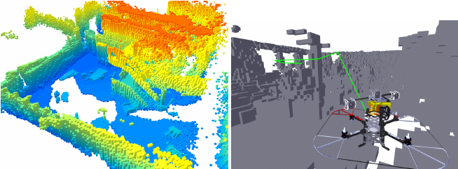
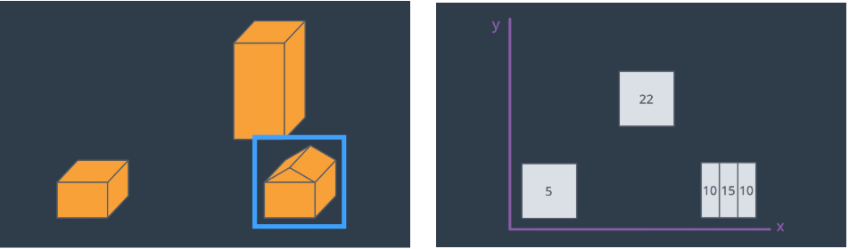
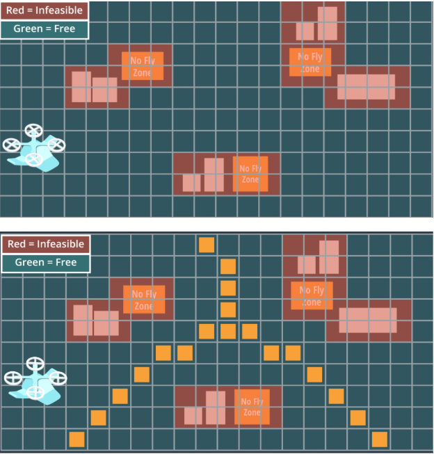
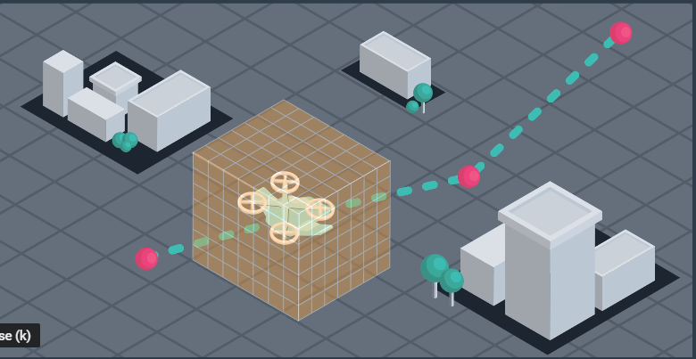
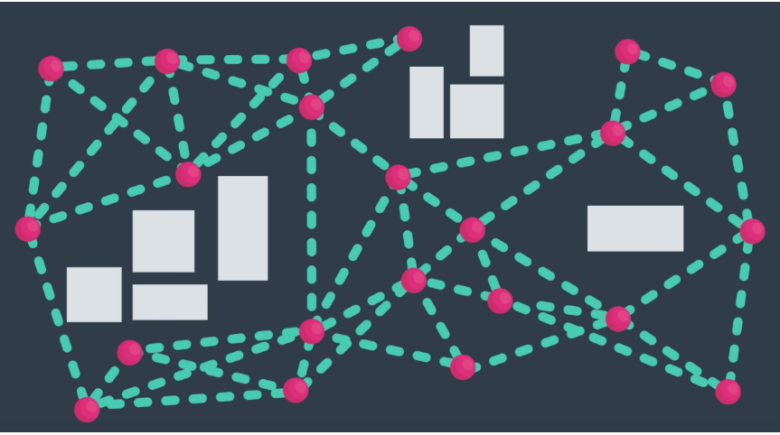

# 
<b> Medial-Axis with Probabilistic Roadmap </b>

 
Planning is a crucial aspect of any autonomous agent. There exist a vast number of methods that attempt to solve this problem. From physical models that describe the intricate dynamics of the object to the black boxes of reinforcement learning. This problem is still an active area of research. 

Any planning solution will address 5 core areas:

1) State Space 
2) Action Space
3) Cost Function
4) Start State
5) Goal State

A tremendous amount of thought should go into defining your state and action spaces, as these decisions will dictate the hardware that your platform needs to operate in real-time. 

For example, representing the state space by 3-dimensional voxels of resultion 0.05m most likely introduces significant memory utilization and long update times. Requiring powerful processing units, a larger battery, heavier quadcopter, and significantly reduced flight time. 

 

<small><i>google images</i></small>

 
This approach assumes the the altitude of the quadcopter is fixed as it navigates through a simulation of San Francisco. As such, a 2.5D map is utilized to create a grid state space.

The following is a representation of a 2.5D map,

 

In essence, a 2.5D map allows for obstacles to be stored efficiently as a 2D grid and the height of that obstacle to be stored as the entry within that cell. Notice that the resolution of obstacles is lost. Planning tight maneuvers around them won't be possible. However, it is usually a bad idea to fly a vehicle very close to, or under, an object, such as a building, bridge, tree, or car. In practice, 2.5D maps work very well and are widely adopted as an efficient means to storing obstacle data.

### 
<b><i>Global Plan</i></b>

Using a grid to represent the state space allows for numerous existing algorithms to be applied to the path planning problem. One in particular is Medial-Axis. 

[Medial-Axis](https://en.wikipedia.org/wiki/Medial_axis) forms the basis of Voronoi Graphs and finds cells that are equi-distant to two different obstacles. By applying a medial-axis transform to our 2.5D grid, I obtain another grid whose cells are farthest from obstacles, inherently fusing safety into the grid.

 

From here, running a well-known grid-based path planner, such as A*, on the medial-axis grid, will obtain the shortest path from the starting location to the goal state.

This Planning approach uses two motion plans,

1) Medial-Axis Global Plan - provides high-level guidance
2) Receding Horizon via a Probabilistic Roadmap - allows for real-time planning within a finite space.

### 
<b><i>Receding Horizon </i></b>

The real-world is dynamic and unpredictable. As such, it is pertinent that autonomous flying vehicles be equipped with mechanisms capable of reacting to sudden changes in environment - another drone, falling debris, birds, toilet-paper rolls, etc. 

Receding Horizon is a concept that employs rapid, local planning toward a target goal.  The area within which the local planner operates is user-defined and depends heavily on the implementation of the local planner (what method is chosen), the hardware of the vehicle, and the rate at which to plan.

The following is an illustration of a local planner,

 

This approach uses a Probabilistic Roadmap (PR) as an implementation of a local planner. With PR, nodes are randomly sampled within a region in space (a sphere). Then, nodes that violate safety regions are discarded. That is, nodes that lie within, along, or too close to, an obstacle are rejected. 

The remaining nodes are used to form a graph - a mesh - from which planning to a high level target is done using a modified version of A* (or whichever planner you choose) and a simple heuristic as a cost function, such as euclidean distance. 

PR has the characteristic of being asymptotically complete and asymptotically optimal. This means that in the case of an infinite number of nodes and conncetions between nodes, PR is guaranteed to find a path and have that path be the shortest.

 

Given real-world hardware contraints, it is incredibly time-consuming and near impossible to find the optimal path for every iteration. However, PR produces paths that are *good-enough* for real-world applications and complete fast enough to be real-time.

### 
<b><i>Simulation </i></b>

The simulator can be downloaded [here](https://github.com/udacity/FCND-Simulator-Releases/releases). Launch the simulator, then run __python probabilistic_roadmap.py__. You can provide latitude and longitude as arguments, just make sure they correspond to locations on the ground. If no lat/long are given, a set of hardcoded goal locations is used.

The following video demonstrates the Probabilistic Roadmap local planner. NOTE, colliders.csv is the 2.5D map. This map does not align 1:1 with the simulation. The portions of space that are removed from the PR mesh represent this misalignment. In reality, point cloud sensor information would be used to plan locally.

 

<small>[full video](https://www.youtube.com/watch?v=24f58EIXmjQ&feature=youtu.be)</small>

